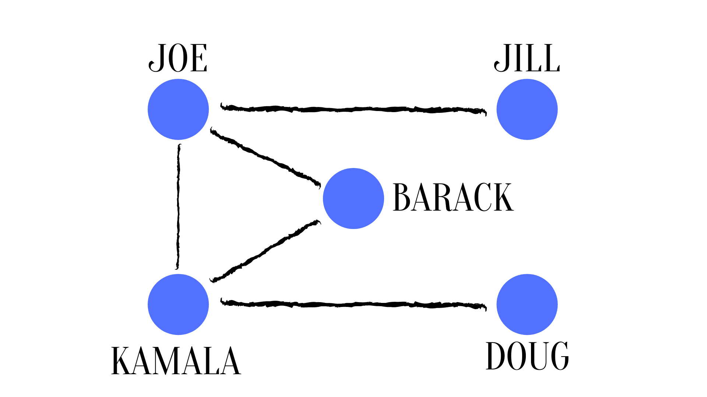
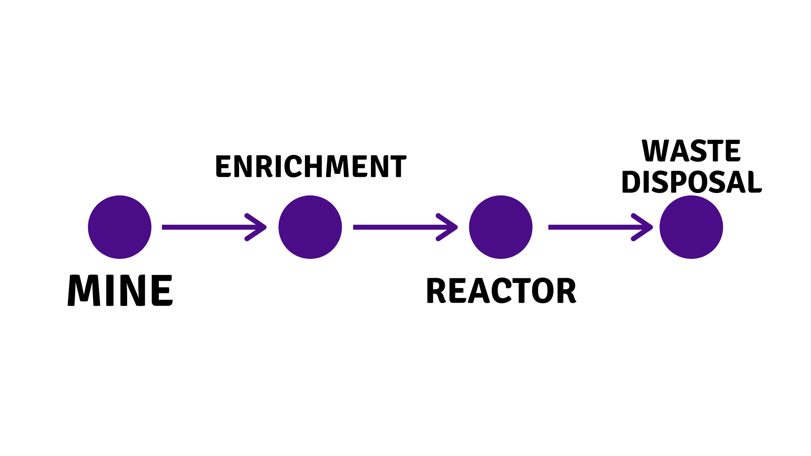
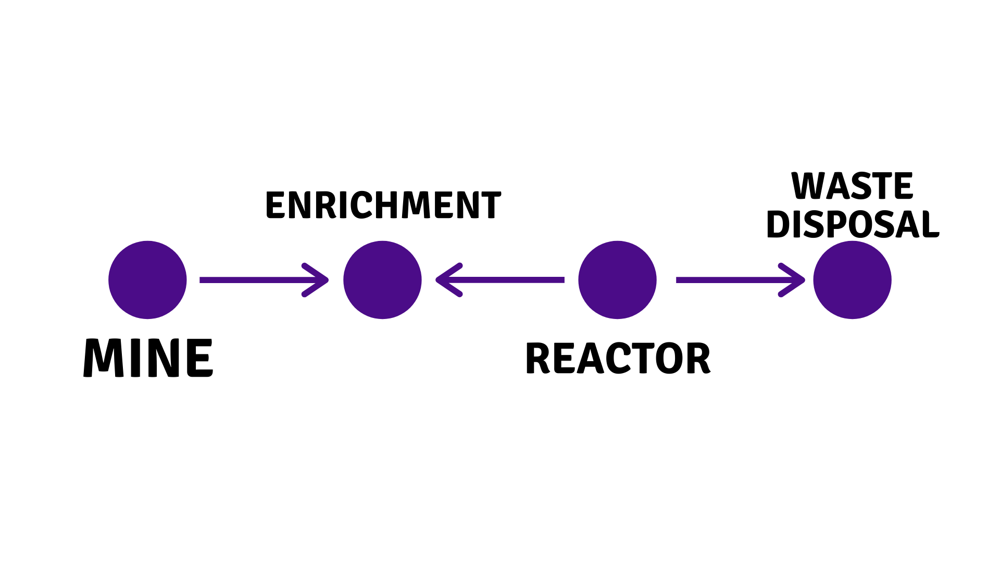
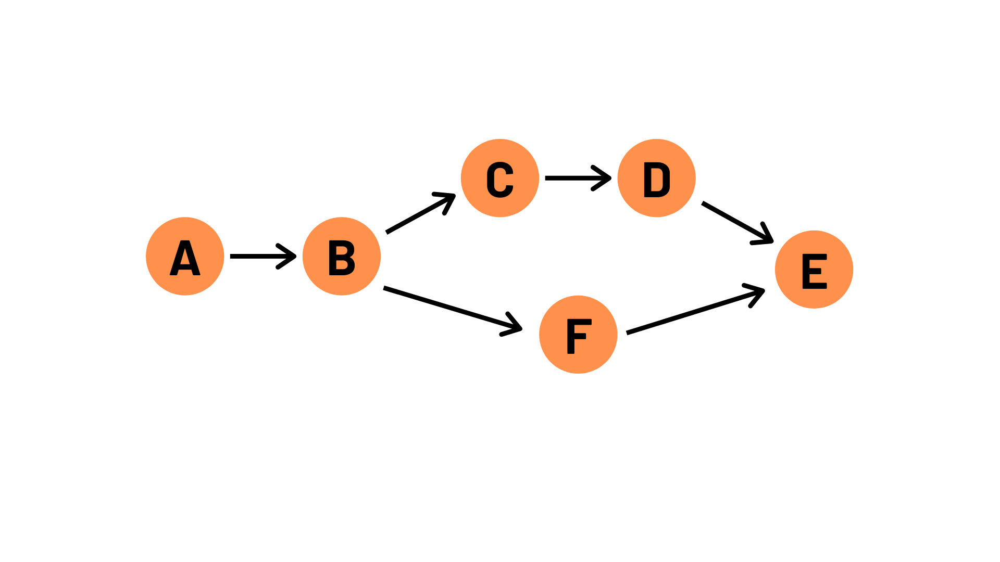

# Github and Python Practice

This Github repo is here as a practice you can use to verify your skills. First, I would recommend getting the [Github Student Developer Pack](https://education.github.com/pack), which gives you access to some features like private repos that you would normally have to pay for. Next, make sure you go through the [First Day on Github](https://lab.github.com/githubtraining/first-day-on-github) tutorial, or the following tasks won't make much sense!

Once you're ready, start below. Feel free to message me on slack or even open an issue if you run into problems (including if I made a mistake and something doesn't work!)

- Fork this repository
- Clone your fork to your machine
- Complete each problem in its own file. You may submit a python file (.py), or something like a [Jupyter notebook](https://jupyter.org/) (.ipynb)
- Try adding, committing, and pushing along the way
- Once you have finished the problems, committed all your work, and pushed it to your fork, open a pull request (PR) to my branch. We'll reveiw it at the next meeting!

## Problems

1. We're going to use networks in our work the rest of the year. Let's try to plot a simple social network. These same ideas can be used to map things like your friends on facebook, but also how nuclear material moves around in the lifecycle of uranium. Use whatever program or style you would like. 

   Joe knows Jill and Kamala. Kamala also knows Doug. Both Joe and Kamala also know Barack.

   Each name is a _node_, and their connections are _edges_. An edge list is given below

   | Person1 | Person2 |
   |---------|---------|
   | Joe     | Jill    |
   | Joe     | Kamala  |
   | Kamala  | Doug    |
   | Barack  | Joe     |
   | Barack  | Kamala  |

   We drew this graph in our last meeting, it looked something like this. But there are many ways to draw a network that are equally valid!

   

   Draw a graph of this network using any package you would like. At the bottom are some network visualization packages and software you may want to try.

2. The network in problem 1 is _undirected_. We also talked about edges that have directions (sometimes called arcs), which can be used to represent physical material moving between facilities (nodes). Let's draw a graph of a very simple set of nuclear facilities, which we call a nuclear fuel cycle.

   | Source     | Target     |
   |------------|------------|
   | Mine       | Enrichment |
   | Enrichment | Reactor    |
   | Reactor    | Disposal   |

   

   This time, the order of the edges matters! If we ignore the order of the edges in the table above and just randomly draw edges from one node to another, we might accidentally end up with the network below, which is incorrect!

   

3. In the previous problems, the information was given in a table, or what is called as an edge list. This time, let's draw a graph from _pathways_, which distills a set of edges down. For example, a pathway

   pathways = [A, B, C, D]

   is identical to this edge list

   | Source | Target |
   | ------ | -------|
   | A      | B      |
   | B      | C      |
   | C      | D      |

   Drawing multiple pathways means you add, but don't duplicate, any additional edges. For example,

   pathways = [A, B, C, D, E], [A, B, F, E]

   is the same as

   | Source | Target |
   | ------ | -------|
   | A      | B      |
   | B      | C      |
   | C      | D      |
   | D      | E      |
   | B      | F      |
   | F      | E      |

   
   Note that I don't need to re-draw the edge from A to B even though it exists in both pathways. This graph will look something like this

   

   
   
   We'll talk about the pros and cons of starting from pathways at our next meeting, can you think of any?

## Graph drawing resources

At our last meeting, I told you that you are able to pick your own graph-drawing package. If you wanted to write one yourself, I won't stop you! (I'm also not going to recommend it, that's not going to be the most efficient way to draw graphs, and will result in major [reinventing of the wheel](https://en.wikipedia.org/wiki/Reinventing_the_wheel)).

Here are some graph drawing python packages and other software to play with. You could try out several if you'd like! I have not used all of these personally. I'd recommend picking one and trying it out for these exercises. Next semester we might take some time to compare and contrast several tools at once.

### [pyvis](https://pyvis.readthedocs.io/en/latest/index.html)

Python package
### [graph tool](https://graph-tool.skewed.de/)

Python package

### [Plotly](https://plotly.com/python/network-graphs/)

Python package. Unlike many of the other python packages here, Plotly is not made primarily or exclusively for drawing graphs. 

### [NetworkX]()

Python package. I use it extensively in my software, but I know they make it clear that drawing/plotting graphs is not a main focus of theirs, and it may be limiting to use their tools. 

### [netwulf](https://github.com/benmaier/netwulf/)

Python package

### [Bokeh](https://docs.bokeh.org/en/latest/index.html)

Python package

### [Gephi](https://gephi.org/)

Separate software platform, will need data to be imported. Can the import and drawing of graphs be automated? (Not sure, real question)

### [Cytoscape](https://cytoscape.org/)

Separate piece of software.